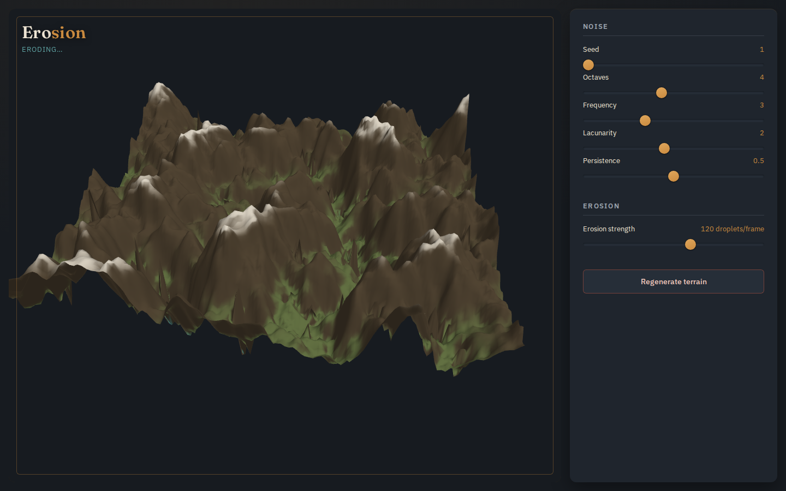

# Erosion

A real-time procedural terrain sculptor. Layered Perlin/Simplex noise generates a
heightmap; an actual hydraulic erosion simulation — thousands of simulated water
droplets carrying and depositing sediment — carves it into valleys and ridgelines
live, in WebGL, as you drag a slider.



This isn't a noise-texture demo. The terrain you see genuinely erodes: droplets
spawn on the heightmap, flow downhill under a simplified physical model, pick up
sediment where they accelerate, and deposit it where they slow down. Run enough
of them and a bumpy random field turns into something that looks geologically real.

## Why

Most "terrain generator" demos on the web stop at layered noise — pretty, but
static and obviously synthetic. Adding real erosion physics is what makes terrain
look *carved* rather than *bumpy*, and doing it live (not as an offline bake) is
what makes it satisfying to play with: drag the erosion-strength slider and watch
rivers and ridges emerge in a couple of seconds.

## The wow moment

Bump the erosion-strength slider from 0 to max on a freshly generated noise field
and watch it visibly self-organize into river valleys and ridgelines within a
couple of seconds — no page reload, no precomputed animation, just the simulation
running live on the GPU/CPU in front of you.

## Running it

```
npm install
npm run dev      # local dev server
npm run build    # static build in dist/, relative-path assets
npm test         # vitest — noise, erosion, mesh, mat4, and control specs
```

## Built so far

- Layered Perlin/Simplex noise heightmap generation (seed, octaves, frequency,
  lacunarity, persistence all live-tunable).
- Droplet-based hydraulic erosion simulation (position, velocity, water volume,
  sediment capacity, deposition/erosion per step), driven live by the erosion-
  strength slider — droplets run every animation frame the strength is above 0.
- Real-time WebGL2 rendering of the heightmap as a shaded 3D mesh with per-vertex
  normals and an elevation/slope color ramp (water, rock, snowcap).
- The brass/slate control console from [`docs/DESIGN.md`](docs/DESIGN.md), with
  themed sliders, a status readout, and a contour-ring flourish.

## Not yet built

- Mouse/touch camera orbit and zoom (the camera currently auto-rotates slowly).
- Synth WebAudio SFX and a mute toggle.
- The bottom-sheet drawer control layout on phone (controls currently stack
  below the viewport instead).

## Stack

- Vanilla JavaScript (ES modules), no framework.
- WebGL2 for rendering (raw GL, no three.js dependency) — keeps the erosion math
  and the render loop both fully inspectable in one small codebase.
- Vite for dev server + static build.
- Vitest for unit tests (noise + erosion simulation logic is pure and testable
  independent of the GPU).

See [`docs/VISION.md`](docs/VISION.md) for the full design rationale and
[`docs/BACKLOG.md`](docs/BACKLOG.md) for the build plan.
